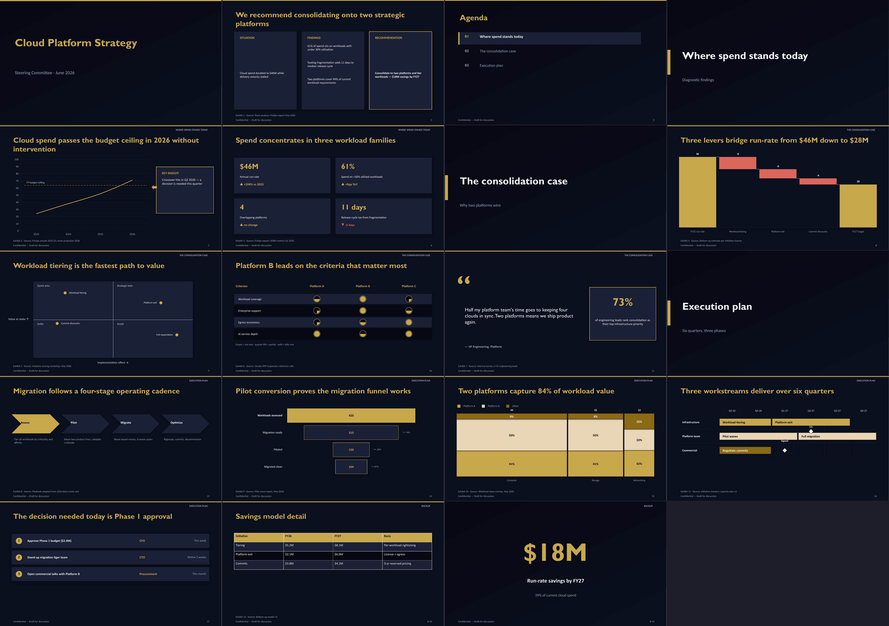
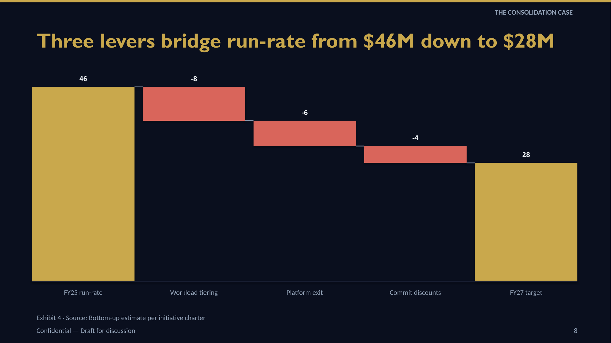

# Presenter Skill

A [Claude Code skill](https://docs.claude.com/en/docs/agents-and-tools/agent-skills) that generates **consulting-grade, natively editable PowerPoint decks** from markdown outlines — real `.pptx` files with proper shapes, charts, and placeholders, not slide images.

Built for tech-strategy work: action titles, SCQA executive summaries, value-bridge waterfalls, 2×2 matrices, harvey-ball scorecards, mekko charts, gantt roadmaps, exhibit sourcing, and a QA pipeline that checks every deck before delivery.



## Features

**34 layouts.** Core set (title, agenda, section dividers, bullets, two-column + chart/image, cards, stat callouts, timeline, comparison, table, full-bleed image, quote) plus a consulting set:

| Layout | Use |
|---|---|
| `waterfall` | Value bridges / cost walks with signed deltas and connectors |
| `matrix-2x2` | Effort/value prioritization with plotted items (add `Size=` for BCG-style bubbles) |
| `harvey-scorecard` | Vendor comparisons with real quarter-fill harvey balls |
| `mekko` | Market maps — column width ∝ size, height = share |
| `bar-mekko` | Profit pool: width ∝ market size, height = value/margin |
| `gantt` | Workstream swimlanes with phase bars + milestone diamonds |
| `exec-summary-scqa` | Situation \| Findings \| Recommendation |
| `chart-callout` | Chart + KEY INSIGHT box, optional dashed benchmark line |
| `dashboard` | KPI tiles with ▲▼ trend deltas |
| `heatmap-table` | Tables with per-column color-interpolated numeric cells (or `- Scale: rag`) |
| `tornado` | Two-sided sensitivity bars sorted by span, central driver spine |
| `football-field` | Valuation-range floating bars with optional marker line |
| `driver-tree` | Left-to-right value decomposition with elbow connectors |
| `stakeholder-map` | Support × influence grid with move arrows to target positions |
| `raci` | Activities × people with colored R/A/C/I letter chips |
| `funnel`, `big-number`, `process-flow`, `next-steps`, `quote-evidence` | …and more |



**Design system.** 10 built-in palettes (dark + light) with per-theme font stacks, WCAG-checked contrast, gradient hero slides, soft card shadows, icon bullets ([Tabler](https://tabler.io/icons)/[Lucide](https://lucide.dev) fetched + tinted automatically), inline rich text (`**bold**`, `{accent}…{/}`), and two density tiers (compact two-column bullets by default). Custom brand palettes: drop a `<name>.json` file (9 required hex keys) into `<assets>/palettes/` and pass `--palette <name>` — or generate one straight from a company's web presence with `brand_kit.py <domain> --name acme` (Brandfetch API when keyed, CSS scrape fallback; classifies colors by luminance, derives contrast-safe text colors, downloads the logo). Image options `image:photo.png|alpha=85` and `|duotone` give brand-tinted, semi-transparent photos; decks containing CJK text automatically swap to a CJK-safe font stack (PingFang SC / Noto Sans CJK). A build-time overflow guard estimates line counts per text box, errors on catastrophic overflow, and writes `normAutofit` shrink (floor 80%) for marginal cases.

**Deck automation.** `**Auto-Agenda:** on|track` auto-inserts agenda slides from section-divider headings; `**Tracker:** tabs` adds a per-section chip strip on every content slide; `**Stamp:** DRAFT` (or CONFIDENTIAL / FOR DISCUSSION) adds a bordered tag on every slide, and per-slide `- Sticker: ILLUSTRATIVE` tags individual exhibits. PowerPoint sections are injected from divider headings (`**Sections:**`, on by default with 2+ dividers); `**References:** on` appends an auto-aggregated Sources backup slide. Heading attributes (`{layout=waterfall palette=aurora}`) set per-slide layout and palette inline — no separate directive line needed. Charts can pull data from CSV via `- Data-File: data/q3.csv`, and `gen_handout.py outline.md` emits a pre-read markdown handout (headings, prose bullets, tables, talk track, footnoted sources).

**Chart intelligence.** `- CAGR: on` draws a growth arrow (single-series bar/column/line); `- Bracket: FY25, FY27` draws a waterfall difference bracket with auto-labeled % change; `- Axis-Max: N` pins the value axis for honest same-scale comparison — or let `**Scale-Group:** auto` compute a shared axis max across same-kind, same-unit charts deck-wide. `- Value-Line: label, value` draws a dashed reference line on bar/column/line charts. Derived percentage labels use largest-remainder rounding so they always sum to 100, and `chart:stacked-100` supports `- Labels: pct|abs|both` dual data labels.

**Consulting discipline.** Action-title validation (the "titles test" via `--titles`, plus chart-slide-needs-a-number and split-the-slide lints), `- Source:` footnotes with optional exhibit numbering, `- Kicker:` bottom takeaway bands, section kickers, `## Appendix` backup slides, speaker-notes coverage warnings, purpose-aware narrative arcs. `--ghost` builds a skeleton deck (real titles, placeholder exhibits) for storyline sign-off before investing in content.

**QA pipeline.** `qa_check.py` catches out-of-bounds shapes, sub-11pt text, leftover placeholders, opaque chart backgrounds (the white-box-on-dark defect), and WCAG contrast failures — layer-aware, so text on cards is checked against the card. `--accessibility` mirrors the MS Accessibility Checker (unique titles, table header rows, real alt text, reading order); `--integrity` validates OOXML structure via the optional `openxml-audit` package. `geometry_report.py` reports deterministic per-slide layout metrics (overlaps, uneven spacing, near-miss alignment, whitespace imbalance, word counts) before any render. `render_slides.py` produces LibreOffice thumbnails for visual review (grid cells are numbered so you can map thumbnails to slide numbers), reviewed against a taxonomy-guided per-flaw checklist plus a 1–5 Content/Design/Coherence rubric. `visual_regress.py` perceptual-hash-diffs a revision's thumbnails against the last delivered baseline so only intended slides change. `qa_check.py --numbers` is a separate numeric-token dump intended for LLM consistency checks (internal arithmetic, repeated KPIs). `pptx_lint.py` adds deck-wide cross-slide checks: anti-jiggle, page-number sequence, font inventory, palette color whitelist, AI-tell heuristics, and a `--gslides` Google Slides compatibility mode.

**Edit mode.** `edit_deck.py` unpacks existing decks to pretty-printed OOXML, supports duplicate/remove/reorder with correct relationship handling, and validates XML before repacking. `inventory` / `replace` subcommands enable bulk text edits via JSON without touching XML directly; `extract` splits a slide range into a new deck and `append` merges slides from one deck into another (parts renamed, rIds remapped, source styling preserved). Template mode maps outline slides onto an existing `.pptx`'s layouts by placeholder signature.

## Install

```bash
git clone https://github.com/rish2jain/Presenter-skill.git ~/.claude/skills/presentation-skill
pip install -r ~/.claude/skills/presentation-skill/requirements.txt
# optional, for high-fidelity visual QA + HEIC images + SVG icons:
brew install --cask libreoffice && brew install poppler
pip install pillow-heif cairosvg
# optional, much faster repeated QA renders (run `unoserver` in the background):
pip install unoserver
```

Claude Code discovers the skill automatically; asking for "a consulting deck on X" triggers it.

## Quickstart (standalone, no Claude needed)

```bash
cd ~/.claude/skills/presentation-skill
python3 scripts/build_deck.py assets/example-outline.md --check     # validate
python3 scripts/build_deck.py assets/example-outline.md --output deck.pptx
python3 scripts/qa_check.py deck.pptx                               # programmatic QA
python3 scripts/pptx_lint.py deck.pptx --palette midnight-executive # deck-wide lint
python3 scripts/render_slides.py deck.pptx --grid --out thumbs/     # visual QA
```

Outline syntax in a nutshell:

```markdown
**Palette:** midnight-executive
**Footer:** "Confidential"
**Page-Numbers:** on
**Exhibits:** on

## Slide 1: Three levers bridge run-rate from $46M down to $28M
**Layout:** waterfall
**Data:**
- FY25 run-rate: 46
- Workload tiering: -8
- Platform exit: -6
- Commit discounts: -4
- FY27 target: total
- Bracket: FY25 run-rate, FY27 target
- Source: "Bottom-up estimate per initiative charter"
- Notes: "Walk the bridge left to right."
```

Full syntax for every layout: [`references/generation-guide.md`](references/generation-guide.md). Storyline discipline (SCQA, dot-dash, titles test): [`references/storyline.md`](references/storyline.md).

## Tests

```bash
python3 -m pytest tests/      # 332 tests
python3 scripts/smoke_test.py # build + QA the example deck end-to-end
```

## Repository layout

```
SKILL.md            entry point — phases, modes, QA protocol
references/         lazily-loaded guides (generation, storyline, editing, QA, ...)
scripts/            build_deck, builders(+consulting), charts, qa_check,
                    pptx_lint, geometry_report, visual_regress, edit_deck,
                    render_slides, prep_images, brand_kit, gen_handout, ...
tests/              pytest suite
assets/             example outline
```
